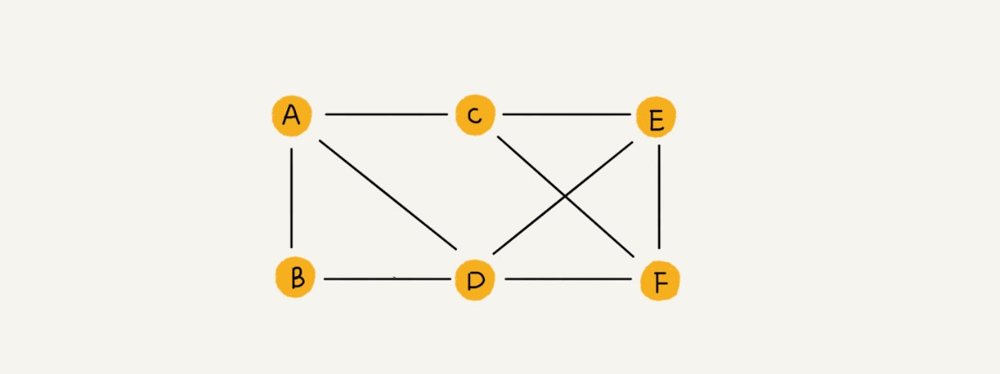
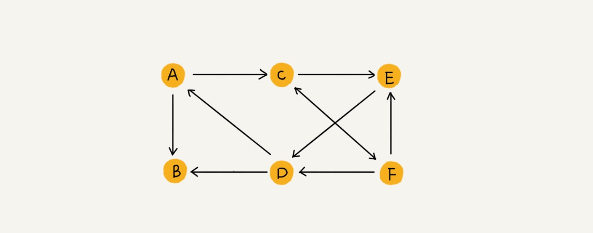
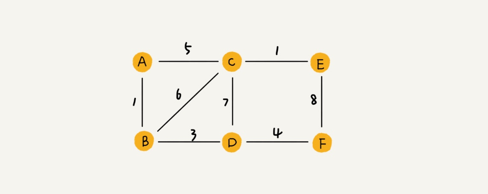
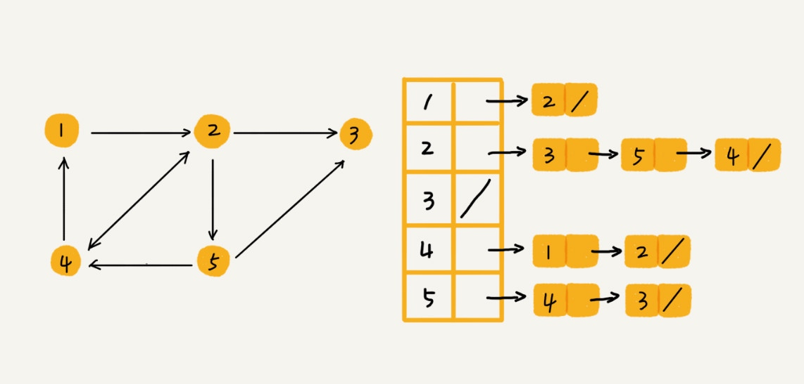

# 图

### 栗子

前面讲过了树这种非线性表数据结构，今天我们要讲另一种非线性表数据结构，图（Graph）。和树比起来，这是一种更加复杂的非线性表结构。

我们知道，树中的元素我们称为节点，图中的元素我们就叫做顶点（vertex）。从我画的图中可以看出来，图中的一个顶点可以与任意其他顶点建立连接关系。我们把这种建立的关系叫做边（edge）。

我们就拿微信举例子吧。我们可以把每个用户看作一个顶点。如果两个用户之间互加好友，那就在两者之间建立一条边。所以，整个微信的好友关系就可以用一张图来表示。其中，每个用户有多少个好友，对应到图中，就叫做顶点的度（degree），就是跟顶点相连接的边的条数。

实际上，微博的社交关系跟微信还有点不一样，或者说更加复杂一点。微博允许单向关注，也就是说，用户 A 关注了用户 B，但用户 B 可以不关注用户 A。那我们如何用图来表示这种单向的社交关系呢？

如果用户 A 关注了用户 B，我们就在图中画一条从 A 到 B 的带箭头的边，来表示边的方向。如果用户 A 和用户 B 互相关注了，那我们就画一条从 A 指向 B 的边，再画一条从 B 指向 A 的边。我们把这种边有方向的图叫做“有向图”。以此类推，我们把边没有方向的图就叫做“无向图”。

无向图中有“度”这个概念，表示一个顶点有多少条边。在有向图中，我们把度分为入度（In-degree）和出度（Out-degree）。顶点的入度，表示有多少条边指向这个顶点；顶点的出度，表示有多少条边是以这个顶点为起点指向其他顶点。对应到微博的例子，入度就表示有多少粉丝，出度就表示关注了多少人。

QQ 中的社交关系要更复杂一点。不知道你有没有留意过 QQ 亲密度这样一个功能。QQ 不仅记录了用户之间的好友关系，还记录了两个用户之间的亲密度，如果两个用户经常往来，那亲密度就比较高；如果不经常往来，亲密度就比较低。如何在图中记录这种好友关系的亲密度呢？

这里就要用到另一种图，带权图（weighted graph）。在带权图中，每条边都有一个权重（weight），我们可以通过这个权重来表示 QQ 好友间的亲密度。

### 图的存储

邻接矩阵

邻接表

