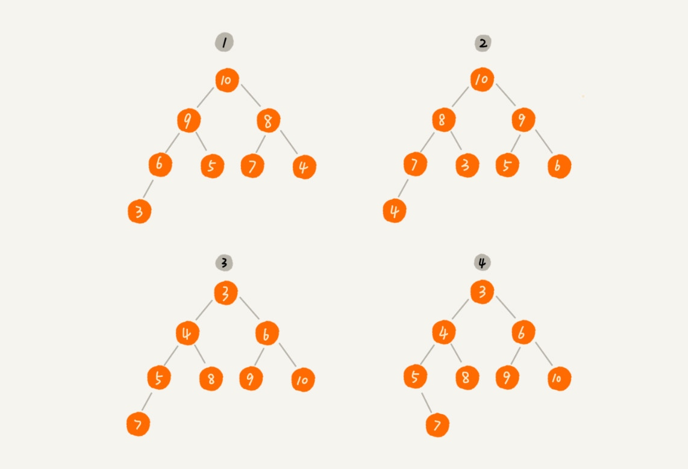
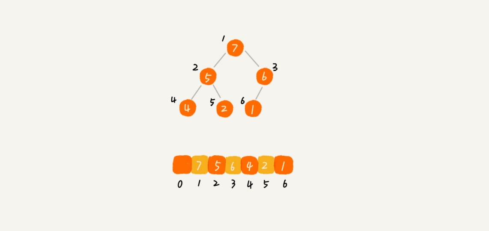

# 堆

### 栗子

堆是一种特殊的树。

* 堆是一个完全二叉树；
* 堆中每一个节点的值都必须大于等于（或小于等于）其子树中每个节点的值。

对于每个节点的值都大于等于子树中每个节点值的堆，我们叫做“大顶堆”。对于每个节点的值都小于等于子树中每个节点值的堆，我们叫做“小顶堆”。

### 堆的存储

数组中下标为 i 的节点的左子节点，就是下标为 i∗2 的节点，右子节点就是下标为 i∗2+1 的节点，父节点就是下标为 2i​ 的节点。