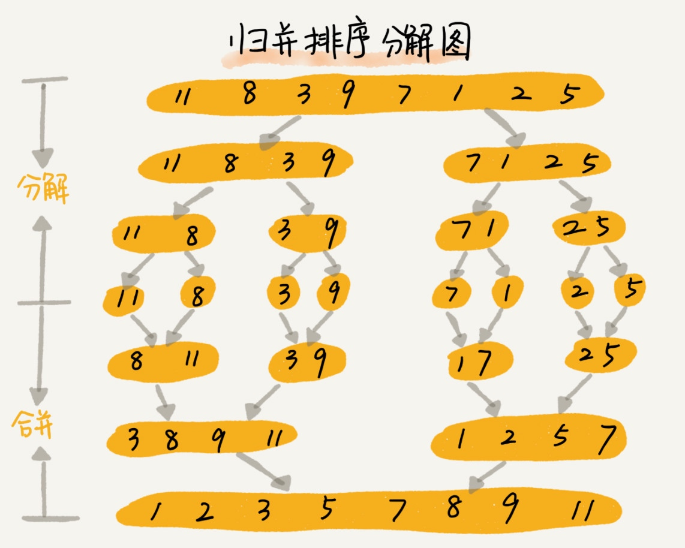

# 归并排序

归并排序的核心思想还是蛮简单的。如果要排序一个数组，我们先把数组从中间分成前后两部分，然后对前后两部分分别排序，再将排好序的两部分合并在一起，这样整个数组就都有序了。



归并排序用的是分治思想，可以用递归来实现。我们现在就来看看如何用递归代码来实现归并排序。

```
    递推公式
    merge_sort(p...r) = merge(merge_sort(p...q), merge_sort(q + 1...r))
    终止条件
    p >= r 不需要再继续分解
```

归并排序的执行效率与要排序的原始数组的有序程度无关，所以其时间复杂度是非常稳定的，不管是最好情况、最坏情况，还是平均情况，时间复杂度都是 O(nlogn)。

归并排序并没有像快排那样，应用广泛，这是为什么呢？因为它有一个致命的“弱点”，那就是归并排序不是原地排序算法。
