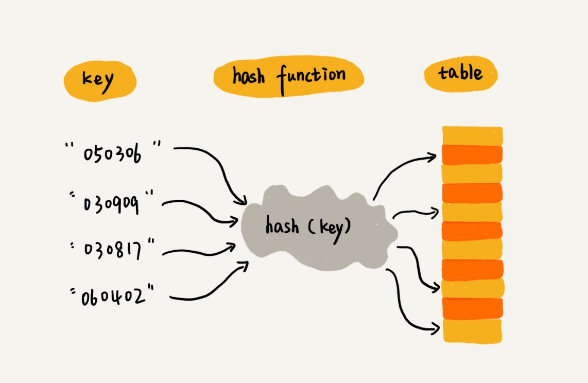
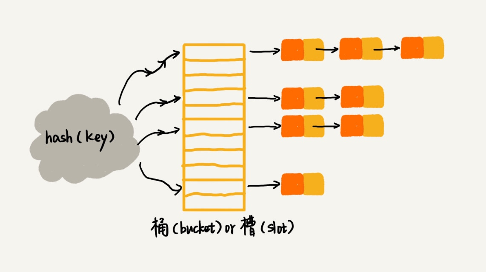

# 散列表

### 栗子和概念

散列表用的是数组支持按照下标随机访问数据的特性，所以散列表其实就是数组的一种扩展，由数组演化而来。可以说，如果没有数组，就没有散列表。

假如我们有 89 名选手参加学校运动会。为了方便记录成绩，每个选手胸前都会贴上自己的参赛号码。这 89 名选手的编号依次是 1 到 89 加上年级、班级。现在我们希望编程实现这样一个功能，通过编号快速找到对应的选手信息。

假设编号用 6 位数字来表示。比如 051167，其中，前两位 05 表示年级，中间两位 11 表示班级，67表示编号，我们可以截取参赛编号的后两位作为数组下标，来存取选手信息数据。当通过参赛编号查询选手信息的时候，我们用同样的方法，取参赛编号的后两位，作为数组下标，来读取数组中的数据。

这就是典型的散列思想。其中，参赛选手的编号我们叫做键（key）或者关键字。我们用它来标识一个选手。我们把参赛编号转化为数组下标的映射方法就叫作散列函数（或“Hash 函数”“哈希函数”），而散列函数计算得到的值就叫作散列值（或“Hash 值”“哈希值”）。


 


散列表用的就是数组支持按照下标随机访问的时候，时间复杂度是 O(1) 的特性。我们通过散列函数把元素的键值映射为下标，然后将数据存储在数组中对应下标的位置。当我们按照键值查询元素时，我们用同样的散列函数，将键值转化数组下标，从对应的数组下标的位置取数据。

### 散列函数

散列函数，顾名思义，它是一个函数。我们可以把它定义成 hash(key)，其中 key 表示元素的键值，hash(key) 的值表示经过散列函数计算得到的散列值。

对于刚才的栗子，散列函数如下：


```
int hash(String key) { // 获取后两位字符 string lastTwoChars = key.substr(length-2, length); // 将后两位字符转换为整数 int hashValue = convert lastTwoChas to int-type; return hashValue;}

```

散列函数的构造：
* 散列函数计算得到的散列值是一个非负整数；
* 如果 key1 = key2，那 hash(key1) == hash(key2)；
* 如果 key1 ≠ key2，那 hash(key1) ≠ hash(key2)。

### 散列冲突
对于不同的key，value的值相同；

#### 开放寻址法
开放寻址法的核心思想是，如果出现了散列冲突，我们就重新探测一个空闲位置，将其插入。那如何重新探测新的位置呢？我先讲一个比较简单的探测方法，线性探测（Linear Probing）。

当我们往散列表中插入数据时，如果某个数据经过散列函数散列之后，存储位置已经被占用了，我们就从当前位置开始，依次往后查找，看是否有空闲位置，直到找到为止。

#### 链表法

在散列表中，每个“桶（bucket）”或者“槽（slot）”会对应一条链表，所有散列值相同的元素我们都放到相同槽位对应的链表中。


