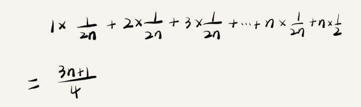

# 时间复杂度的各种情况

```
function find(array, x) {
    let position = -1;
    for (let i = 0; i < array.length; i += 1) {
        if (array[i] === x) {
            break;
        }
    }
    return position;
}
```

### 最好时间复杂度
* 要查找的变量 x 可能出现在数组的任意位置。
* 如果数组中第一个元素正好是要查找的变量 x，
* 那就不需要继续遍历剩下的 n-1 个数据了，
* 那时间复杂度就是 O(1)

### 最坏时间复杂度
* 但如果数组中不存在变量 x
* 那我们就需要把整个数组都遍历一遍
* 时间复杂度就成了 O(n)

### 平均时间复杂度
* 要查找的变量 x 在数组中的位置，有 n+1 种情况：在数组的 0～n-1 位置中和不在数组中。我们把每种情况下，查找需要遍历的元素个数累加起来，然后再除以 n+1，就可以得到需要遍历的元素个数的平均值。
* 要查找的变量 x，要么在数组里，要么就不在数组里。假设在数组中与不在数组中的概率都为 1/2。另外，要查找的数据出现在 0～n-1 这 n 个位置的概率也是一样的，为 1/n。所以，根据概率乘法法则，要查找的数据出现在 0～n-1 中任意位置的概率就是 1/(2n)。

* 引入概率之后，前面那段代码的加权平均值为 (3n+1)/4。用大 O 表示法来表示，去掉系数和常量，这段代码的加权平均时间复杂度仍然是 O(n)。

### 场景
大多数情况下是不需要区分的，只有同一块代码在不同的情况下，时间复杂度有量级的差距，我们才会使用这三种复杂度表示法来区分。
