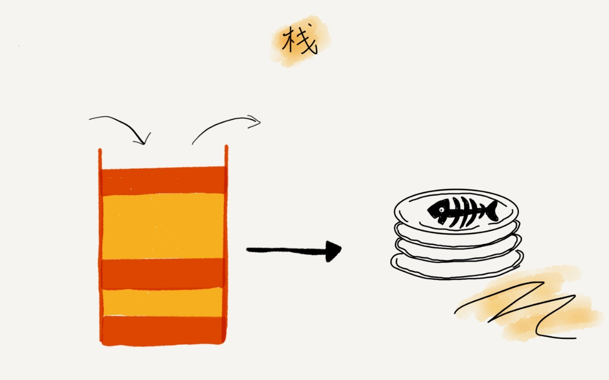
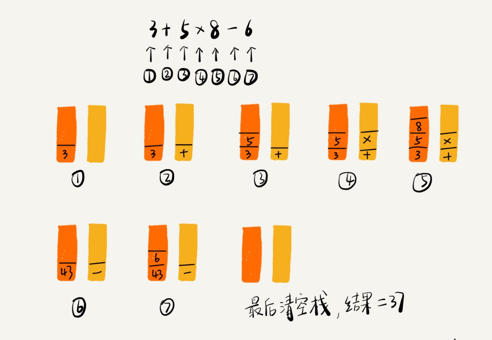

# 栈

### 概念

栈是一种“操作受限”的线性表，只允许在一端插入和删除数据。相比数组和链表，栈带给我的只有限制，并没有任何优势。那直接使用数组或者链表不就好了吗？为什么还要用这个“操作受限”的“栈”呢？

事实上，从功能上来说，数组或链表确实可以替代栈，但是，特定的数据结构是对特定场景的抽象，而且，数组或链表暴露了太多的操作接口，操作上的确灵活自由，但使用时就比较不可控，自然也就更容易出错。

不管是顺序栈还是链式栈，入栈、出栈只涉及栈顶个别数据的操作，所以时间复杂度都是 O(1)。

### 函数调用栈

操作系统给每个线程分配了一块独立的内存空间，这块内存被组织成“栈”这种结构, 用来存储函数调用时的临时变量。每进入一个函数，就会将临时变量作为一个栈帧入栈，当被调用函数执行完成，返回之后，将这个函数对应的栈帧出栈。

### 编译器的表达式求值

编译器通过两个栈来实现。其中一个保存操作数的栈，另一个是保存运算符的栈。我们从左向右遍历表达式，当遇到数字，我们就直接压入操作数栈；当遇到运算符，就与运算符栈的栈顶元素进行比较。

如果比运算符栈顶元素的优先级高，就将当前运算符压入栈；如果比运算符栈顶元素的优先级低或者相同，从运算符栈中取栈顶运算符，从操作数栈的栈顶取 2 个操作数，然后进行计算，再把计算完的结果压入操作数栈，继续比较。

