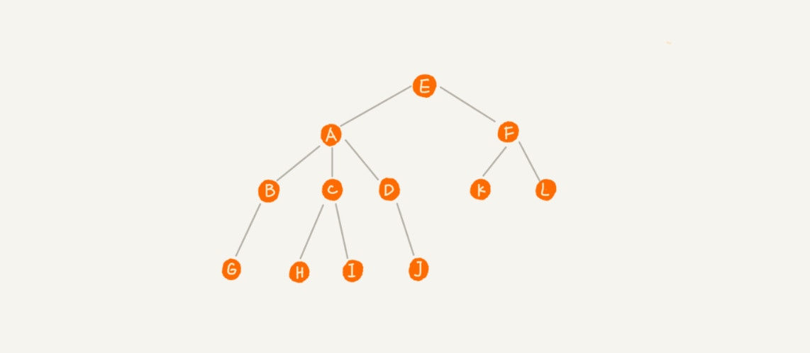
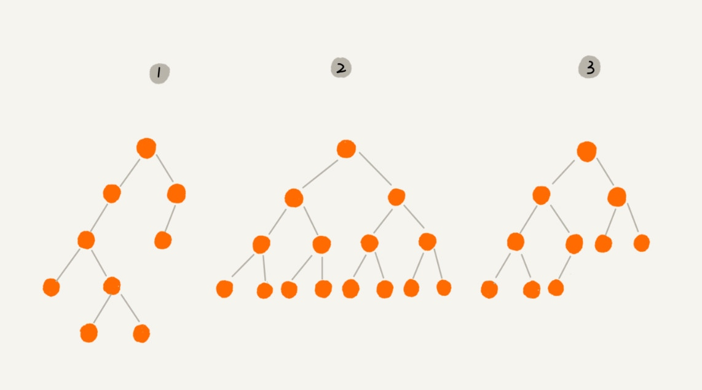
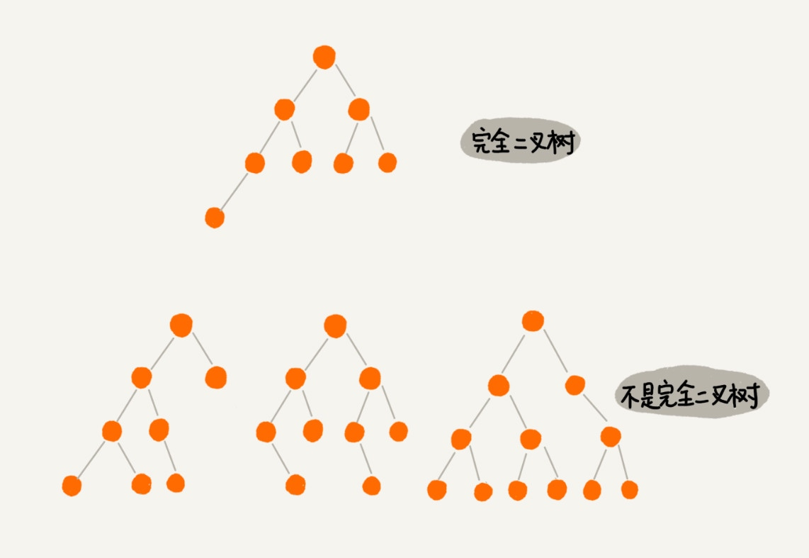
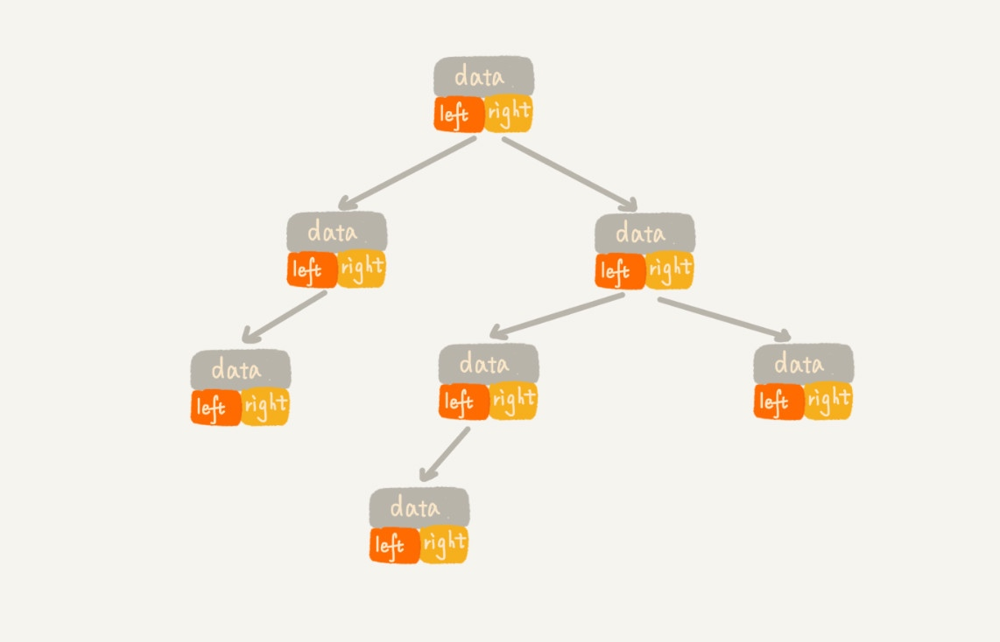
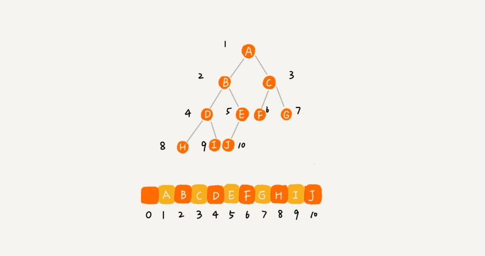

# 树

### 节点

下面这幅图，A 节点就是 B 节点的父节点，B 节点是 A 节点的子节点。B、C、D 这三个节点的父节点是同一个节点，所以它们之间互称为兄弟节点。我们把没有父节点的节点叫做根节点，也就是图中的节点 E。我们把没有子节点的节点叫做叶子节点或者叶节点，比如图中的 G、H、I、J、K、L 都是叶子节点。

### 二叉树

其中，编号 2 的二叉树中，叶子节点全都在最底层，除了叶子节点之外，每个节点都有左右两个子节点，这种二叉树就叫做满二叉树。

编号 3 的二叉树中，叶子节点都在最底下两层，最后一层的叶子节点都靠左排列，并且除了最后一层，其他层的节点个数都要达到最大，这种二叉树叫做完全二叉树。

### 二叉树的存储

#### 链式存储
每个节点有三个字段，其中一个存储数据，另外两个是指向左右子节点的指针。我们只要拎住根节点，就可以通过左右子节点的指针，把整棵树都串起来。这种存储方式我们比较常用。大部分二叉树代码都是通过这种结构来实现的。

#### 顺序存储

我们把根节点存储在下标 i = 1 的位置，那左子节点存储在下标 2 * i = 2 的位置，右子节点存储在 2 * i + 1 = 3 的位置。以此类推，B 节点的左子节点存储在 2 * i = 2 * 2 = 4 的位置，右子节点存储在 2 * i + 1 = 2 * 2 + 1 = 5 的位置。

如果节点 X 存储在数组中下标为 i 的位置，下标为 2 * i 的位置存储的就是左子节点，下标为 2 * i + 1 的位置存储的就是右子节点。反过来，下标为 i/2 的位置存储就是它的父节点。通过这种方式，我们只要知道根节点存储的位置（一般情况下，为了方便计算子节点，根节点会存储在下标为 1 的位置），这样就可以通过下标计算，把整棵树都串起来。