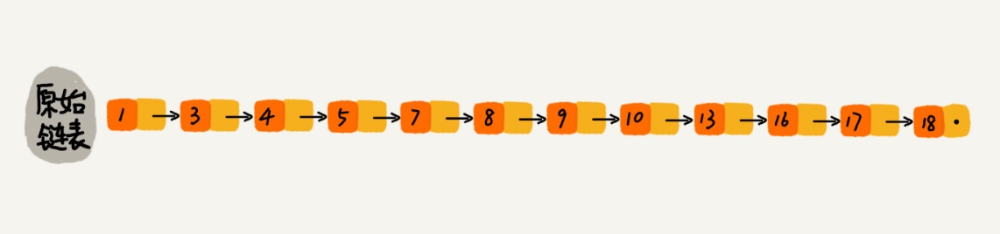
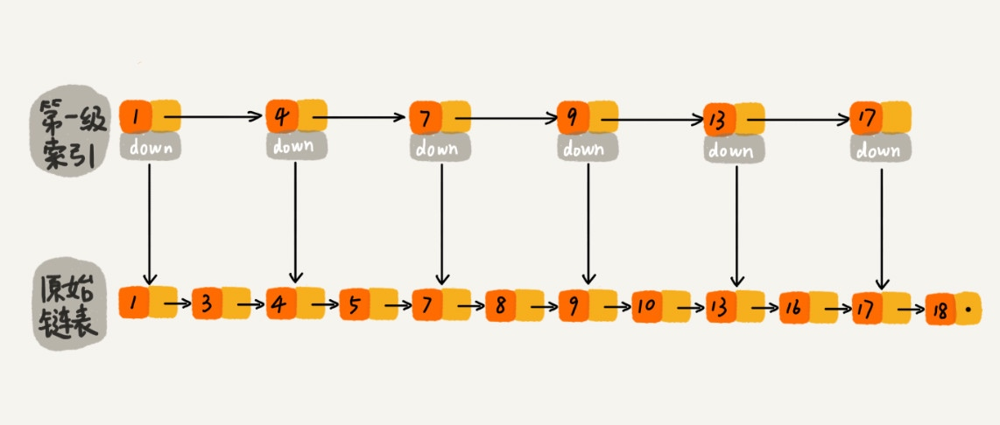
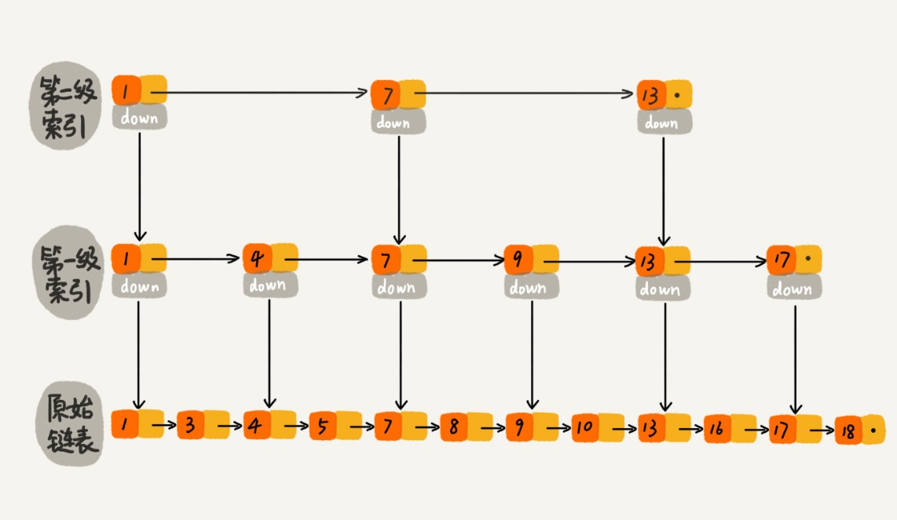

# 跳表

### 理解跳表

对于一个单链表来讲，即便链表中存储的数据是有序的，如果我们要想在其中查找某个数据，也只能从头到尾遍历链表。这样查找效率就会很低，时间复杂度会很高，是 O(n)。

那怎么来提高查找效率呢？如果像图中那样，对链表建立一级“索引”，查找起来是不是就会更快一些呢？每两个结点提取一个结点到上一级，我们把抽出来的那一级叫做索引或索引层。

如果我们现在要查找某个结点，比如 16。我们可以先在索引层遍历，当遍历到索引层中值为 13 的结点时，我们发现下一个结点是 17，那要查找的结点 16 肯定就在这两个结点之间。然后我们通过索引层结点的 down 指针，下降到原始链表这一层，继续遍历。这个时候，我们只需要再遍历 2 个结点，就可以找到值等于 16 的这个结点了。这样，原来如果要查找 16，需要遍历 10 个结点，现在只需要遍历 7 个结点。

这种链表加多级索引的结构，就是跳表。