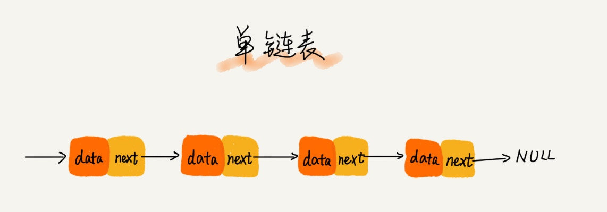
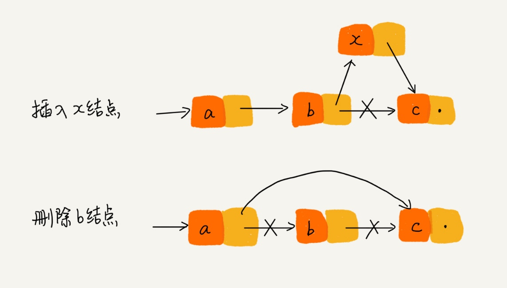
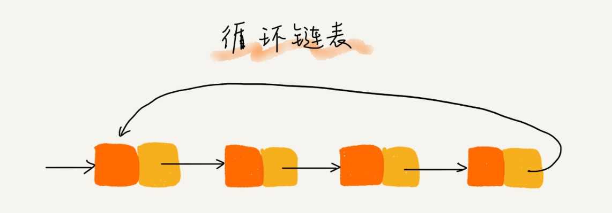
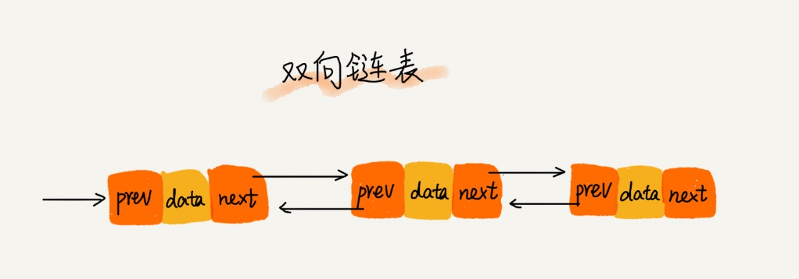

# 链表

### 单链表

链表通过指针将一组零散的内存块串联在一起。其中，我们把内存块称为链表的“结点”。为了将所有的结点串起来，每个链表的结点除了存储数据之外，还需要记录链上的下一个结点的地址。如图所示，我们把这个记录下个结点地址的指针叫作后继指针 next。

针对链表的插入和删除操作，我们只需要考虑相邻结点的指针改变，所以对应的时间复杂度是 O(1)。

### 循环链表

循环链表跟单链表唯一的区别就在尾结点。我们知道，单链表的尾结点指针指向空地址，表示这就是最后的结点了。而循环链表的尾结点指针是指向链表的头结点。

### 双向链表

单向链表只有一个方向，结点只有一个后继指针 next 指向后面的结点。而双向链表，顾名思义，它支持两个方向，每个结点不止有一个后继指针 next 指向后面的结点，还有一个前驱指针 prev 指向前面的结点。

### 空间换时间

当内存空间充足的时候，如果我们更加追求代码的执行速度，我们就可以选择空间复杂度相对较高、但时间复杂度相对很低的算法或者数据结构。相反，如果内存比较紧缺，比如代码跑在手机或者单片机上，这个时候，就要反过来用时间换空间的设计思路。

缓存实际上就是利用了空间换时间的设计思想。如果我们把数据存储在硬盘上，会比较节省内存，但每次查找数据都要询问一次硬盘，会比较慢。但如果我们通过缓存技术，事先将数据加载在内存中，虽然会比较耗费内存空间，但是每次数据查询的速度就大大提高了。

### LRU的思路

维护一个有序单链表，越靠近链表尾部的结点是越早之前访问的。当有一个新的数据被访问时，我们从链表头开始顺序遍历链表。

* 如果此数据之前已经被缓存在链表中了，我们遍历得到这个数据对应的结点，并将其从原来的位置删除，然后再插入到链表的头部。
* 如果此数据没有在缓存链表中，又可以分为两种情况：
  - 如果此时缓存未满，则将此结点直接插入到链表的头部；
  - 如果此时缓存已满，则链表尾结点删除，将新的数据结点插入链表的头部。
