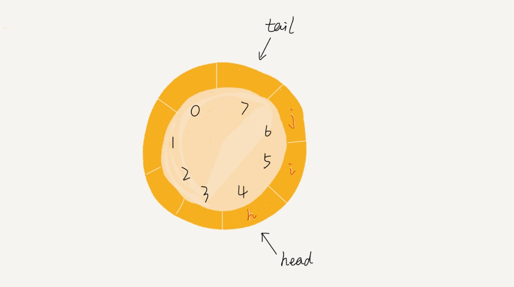
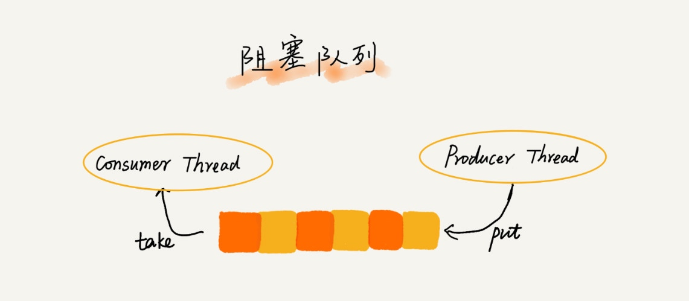

# 队列

### 顺序队列和链式队列

基于数组实现的队列是顺序队列，基于链表实现的队列是链式队列。


```
// 用数组实现的队列
public class ArrayQueue {
  // 数组：items，数组大小：n
  private String[] items;
  private int n = 0;
  // head表示队头下标，tail表示队尾下标
  private int head = 0;
  private int tail = 0;

  // 申请一个大小为capacity的数组
  public ArrayQueue(int capacity) {
    items = new String[capacity];
    n = capacity;
  }

  // 入队
  public boolean enqueue(String item) {
    // 如果tail == n 表示队列已经满了
    if (tail == n) return false;
    items[tail] = item;
    ++tail;
    return true;
  }

  // 出队
  public String dequeue() {
    // 如果head == tail 表示队列为空
    if (head == tail) return null;
    String ret = items[head];
    ++head;
    return ret;
  }
}
```

队列需要两个指针：一个是 head 指针，指向队头；一个是 tail 指针，指向队尾。

### 循环队列

它长得像一个环。原本数组是有头有尾的，是一条直线。现在我们把首尾相连，扳成了一个环。我画了一张图，你可以直观地感受一下。



### 阻塞队列
阻塞队列其实就是在队列基础上增加了阻塞操作。简单来说，就是在队列为空的时候，从队头取数据会被阻塞。因为此时还没有数据可取，直到队列中有了数据才能返回；如果队列已经满了，那么插入数据的操作就会被阻塞，直到队列中有空闲位置后再插入数据，然后再返回。



### 线程池的资源处理
线程池没有空闲线程时，新的任务请求线程资源时，线程池该如何处理？各种处理策略又是如何实现的呢？

我们一般有两种处理策略。第一种是非阻塞的处理方式，直接拒绝任务请求；另一种是阻塞的处理方式，将请求排队，等到有空闲线程时，取出排队的请求继续处理。那如何存储排队的请求呢？

我们希望公平地处理每个排队的请求，先进者先服务，所以队列这种数据结构很适合来存储排队请求。我们前面说过，队列有基于链表和基于数组这两种实现方式。这两种实现方式对于排队请求又有什么区别呢？

基于链表的实现方式，可以实现一个支持无限排队的无界队列（unbounded queue），但是可能会导致过多的请求排队等待，请求处理的响应时间过长。所以，针对响应时间比较敏感的系统，基于链表实现的无限排队的线程池是不合适的。

而基于数组实现的有界队列（bounded queue），队列的大小有限，所以线程池中排队的请求超过队列大小时，接下来的请求就会被拒绝，这种方式对响应时间敏感的系统来说，就相对更加合理。不过，设置一个合理的队列大小，也是非常有讲究的。队列太大导致等待的请求太多，队列太小会导致无法充分利用系统资源、发挥最大性能。
